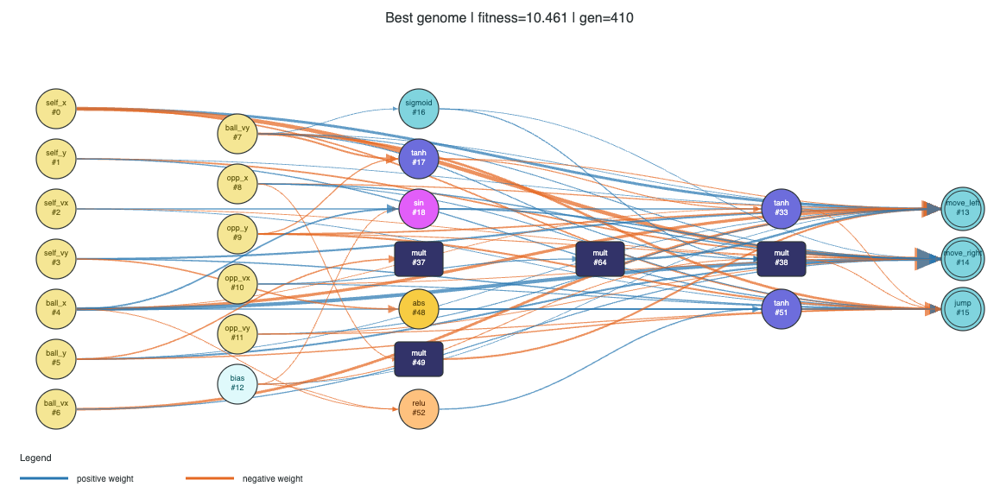

# Neuroevolution for Slime Volleyball

NEAT-style neuroevolution experiments for training a Slime Volleyball agent.
The project evolves compact feed-forward neural network topologies, evaluates
them in `slimevolleygym`, and saves the best genome for later scoring,
recording, and visualization.


This project can produce a trained genome, a gameplay capture, and a rendered
network graph from the evolved NEAT policy.

<p align="center">
  
</p>

<p align="center">
  <em>Left: baseline / Right: NEAT agent</em>
</p>

<p align="center">
  
</p>

Saved genome:
[`saved/best_genome.json`](saved/best_genome.json)

```json
{
  "fitness": 10.460901805415437,
  "metadata": {
    "score_type": "training_fitness",
    "generation": 410,
    "opponent_mode": "baseline",
    "action_mode": "exclusive"
  }
}
```

The gameplay capture shows the final behavior. Qualitatively, the agent is much
better than the earlier head-juggling policy: it sends the ball across the net
more often and behaves more like an actual volleyball player. However, raw
evaluation shows that it is still not consistently stronger than the built-in
baseline opponent. Over 100 evaluation episodes, the agent achieved 3 wins,
4 draws, and 93 losses, with 44 points for and 333 points against, for a point
win rate of about 11.7%.

The main takeaway is that this NEAT system successfully evolved non-trivial
network structures and improved behavior, but the final policy did not fully
solve the game. Shaped fitness produced visually interesting progress, while
also showing how easily evolution can optimize unintended behaviors. Better
future versions would need fitness shaping more closely aligned with raw game
score, or possibly a self-play curriculum.

## Overview

The agent observes the 12-value SlimeVolley state vector and outputs three
binary actions: move left, move right, and jump. Training starts from a minimal
input-to-output network and mutates both weights and topology over generations.

Main pieces:

- `src/genome.py`: genome creation and structural mutations.
- `src/network.py`: feed-forward genome evaluation and action conversion.
- `src/evaluate.py`: SlimeVolley rollouts, shaped fitness, raw scoring, and MP4 recording.
- `src/evolve.py`: evolutionary loop with elitism, k-medoids speciation, crossover, mutation, stagnation reset, and best-genome saving.
- `src/evaluate_saved.py`: CLI for scoring or recording a saved genome.
- `scripts/visualize_genome.py`: Graphviz/fallback SVG renderer for saved genomes.

## Setup

This repo uses `slimevolleygym` as a git submodule.

```bash
git submodule update --init --recursive

python3 -m venv .venv
source .venv/bin/activate

python -m pip install --upgrade pip setuptools wheel
python -m pip install gym==0.20.0 numpy opencv-python pyglet==1.5.11
python -m pip install --no-deps -e ./slimevolleygym
```

Use this `PYTHONPATH` when running project modules:

```bash
export PYTHONPATH=.:./slimevolleygym
```

## Train

Run the default evolutionary training loop:

```bash
PYTHONPATH=.:./slimevolleygym .venv/bin/python src/evolve.py
```

The best genome is written to:

```text
saved/best_genome.json
```

Training defaults such as population size, generation count, worker count,
mutation rates, opponent mode, and reward-shaping coefficients are currently
defined as arguments to `evolve()` in `src/evolve.py`.

## Evaluate A Saved Genome

Score the saved genome using raw SlimeVolley reward, without training-only
shaping:

```bash
PYTHONPATH=.:./slimevolleygym .venv/bin/python -m src.evaluate_saved \
  --path saved/best_genome.json \
  --episodes 100
```

Record one gameplay episode:

```bash
PYTHONPATH=.:./slimevolleygym .venv/bin/python -m src.evaluate_saved \
  --path saved/best_genome.json \
  --record-mp4 saved/best_gameplay.mp4
```

Render live gameplay instead of printing only stats:

```bash
PYTHONPATH=.:./slimevolleygym .venv/bin/python -m src.evaluate_saved \
  --path saved/best_genome.json \
  --render
```

## Visualize A Genome

Generate a genome graph from a saved genome:

```bash
.venv/bin/python scripts/visualize_genome.py \
  --path saved/best_genome.json \
  --out saved/best_genome_graph \
  --format png
```

PNG and PDF output require Graphviz `dot`. SVG output can use Graphviz when it
is installed, and otherwise falls back to the script's built-in SVG renderer.

Useful options:

```bash
.venv/bin/python scripts/visualize_genome.py --show-disabled --show-weights
```

## Outputs

- `saved/best_genome.json`: current best saved genome.
- `saved/best_gameplay.gif`: gameplay capture for the current saved genome.
- `saved/best_genome_graph.png`: rendered network graph.

Most generated videos are ignored by git. The current gameplay GIF is kept so
the README preview renders on GitHub.
